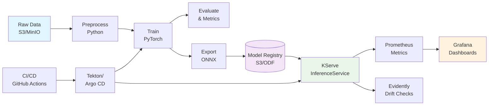

# End-to-End AI/ML Pipeline on OpenShift AI (RHOAI)

Predictive + Generative AI workflow with preprocessing → training → evaluation → model registry → serving → monitoring → CI/CD, deployable on Red Hat OpenShift AI (RHOAI) and vanilla Kubernetes (kind/minikube).

## 🎯 Project Goal

Build and deploy an end-to-end MLOps pipeline on Red Hat OpenShift AI (or Kubernetes), integrating model training, evaluation, serving, and monitoring with open-source tools.

This project demonstrates:
- AI/ML workflow automation (preprocessing → training → serving → monitoring)
- Kubernetes/OpenShift and containerization
- Hybrid cloud and open-source collaboration
- End-to-end MLOps design and debugging skills
- Comfort with AI/ML lifecycle management

## ✨ Highlights

- **Pipelines**: Tekton (OpenShift Pipelines) or Kubeflow / OpenShift Data Science Pipelines
- **Training**: PyTorch + Hugging Face (predictive + small LLM task)
- **Serving**: KServe (preferred on RHOAI) or FastAPI fallback
- **Observability**: Prometheus + Grafana, basic drift monitoring (Evidently)
- **Registry/Artifacts**: S3-compatible (MinIO or ODF)
- **CI/CD**: GitHub Actions → build, scan, push → Argo CD/Tekton deploy (optional)

## 🗺️ Architecture



## 🧰 Tech Stack

| Category | Tools |
|----------|-------|
| **Language** | Python (core), optional Go (microservice/CLI) |
| **ML** | PyTorch, Hugging Face Transformers, ONNX |
| **Pipelines/MLOps** | Tekton (OpenShift), Kubeflow (vanilla) |
| **Serving** | KServe (KFServing) on OpenShift AI; FastAPI fallback |
| **Observability** | Prometheus, Grafana, Evidently |
| **Storage** | MinIO / OpenShift Data Foundation (S3 API) |
| **DevOps** | Docker/Podman, GitHub Actions, Argo CD (optional) |

## 📁 Repository Structure

```
ml-pipeline-openshift/
├── data/                     # sample data or ingestion scripts
├── training/
│   ├── train.py               # preprocess + train + eval
│   ├── export_onnx.py         # export model to ONNX
│   ├── requirements.txt
│   └── Dockerfile
├── inference/
│   ├── app.py                 # FastAPI fallback server
│   ├── onnx_runtime.py
│   ├── requirements.txt
│   └── Dockerfile
├── pipeline/
│   ├── tekton/                # Tekton PipelineRuns, Tasks
│   └── kubeflow/              # Kubeflow pipeline spec (YAML/py)
├── k8s/
│   ├── kserve-inferenceservice.yaml
│   ├── serviceaccount-rbac.yaml
│   ├── hpa.yaml
│   └── minio/                 # optional local MinIO manifests
├── monitoring/
│   ├── prometheus-rules.yaml
│   ├── grafana-dashboards/
│   └── evidently-job.yaml
├── .github/workflows/
│   └── ci.yaml                # build, test, image push
├── Makefile
└── README.md
```

## ✅ Prerequisites

- OpenShift 4.x with OpenShift AI (RHOAI), or local kind/minikube
- `oc` CLI (for OpenShift) or `kubectl` (vanilla k8s)
- Docker/Podman for building images
- Python 3.11+, Node (optional UI)
- Container registry (Quay.io, GHCR, or OpenShift internal)

## 🚀 Quick Start (Local Kubernetes)

### 1. Clone & Configure
```bash
git clone https://github.com/yourname/ml-pipeline-openshift.git
cd ml-pipeline-openshift
cp .env.example .env   # fill in S3/registry creds
```

### 2. Start Cluster (choose one)
```bash
# kind
kind create cluster --name mlops

# or minikube
minikube start --cpus=4 --memory=8192
```

### 3. Deploy MinIO (optional local S3)
```bash
kubectl apply -k k8s/minio/
```

### 4. Build & Push Images
```bash
make build-train IMG=ghcr.io/yourname/train:latest
make push-train IMG=ghcr.io/yourname/train:latest

make build-infer IMG=ghcr.io/yourname/infer:latest
make push-infer IMG=ghcr.io/yourname/infer:latest
```

### 5. Run Training Pipeline
```bash
# Tekton
kubectl apply -f pipeline/tekton/tasks/train-task.yaml
kubectl apply -f pipeline/tekton/pipelinerun/train-run.yaml

# OR plain k8s Job
kubectl apply -f pipeline/k8s/train-job.yaml
```

### 6. Export & Register Model
Training container runs `export_onnx.py` and uploads to S3 (`s3://models/<model>.onnx`).
Verify artifact exists in MinIO/ODF bucket.

### 7. Deploy Serving with KServe
```bash
kubectl apply -f k8s/serviceaccount-rbac.yaml
kubectl apply -f k8s/kserve-inferenceservice.yaml
kubectl get inferenceservices
```

### 8. Setup Monitoring
```bash
kubectl apply -f monitoring/prometheus-rules.yaml
kubectl apply -f monitoring/grafana-dashboards/
kubectl apply -f monitoring/evidently-job.yaml  # scheduled drift checks
```

## ☁️ OpenShift AI (RHOAI) Notes

- **Data Science Projects**: Create a project, attach storage, enable pipelines
- **OpenShift Pipelines (Tekton)**: Import `pipeline/tekton/*` via Developer view → Pipelines
- **Model Serving**: Prefer KServe InferenceService (`k8s/kserve-inferenceservice.yaml`) with S3 model URI:
  ```yaml
  spec:
    predictor:
      model:
        modelFormat:
          name: onnx
        storageUri: s3://models/your-model.onnx
        runtime: "ovms-1.x"   # or onnxruntime runtime if available
  ```
- **Routes**: OpenShift will create a public Route for the service; check `oc get route`

## 🔧 Configuration

Create `.env` (or use k8s Secrets):
```bash
S3_ENDPOINT=http://minio.minio:9000
S3_BUCKET=models
S3_ACCESS_KEY=minioadmin
S3_SECRET_KEY=minioadmin
MODEL_NAME=baseline-onnx
REGISTRY=ghcr.io/yourname
```

## 🏗️ Makefile (snippet)
```makefile
IMG ?= ghcr.io/yourname/infer:latest

build-train:
	docker build -t $(REGISTRY)/train:latest training

push-train:
	docker push $(REGISTRY)/train:latest

build-infer:
	docker build -t $(REGISTRY)/infer:latest inference

push-infer:
	docker push $(REGISTRY)/infer:latest

deploy-kserve:
	kubectl apply -f k8s/serviceaccount-rbac.yaml
	kubectl apply -f k8s/kserve-inferenceservice.yaml
```

## 🧪 Local Testing (FastAPI fallback)
```bash
# run locally
cd inference
pip install -r requirements.txt
uvicorn app:app --reload --port 8080

# test
curl -X POST http://localhost:8080/v1/predict \
  -H "Content-Type: application/json" \
  -d '{"inputs":[...]}'
```

## 📈 Observability

- **Prometheus** scrapes KServe metrics (latency, QPS)
- **Grafana** imports dashboards from `monitoring/grafana-dashboards/`
- **Evidently** runs as a cron Job comparing recent predictions to baseline, emits drift alerts (optionally to Slack/Webhook)

## 🔄 CI/CD (Optional)

- **GitHub Actions**: `.github/workflows/ci.yaml`
  - Lint & tests
  - Build/push images
  - Apply Tekton PipelineRun (if using a service account)
- **Argo CD**: Track `k8s/` and auto-sync to clusters/environments

## 🧭 Roadmap

- [ ] Add GPU training & serving node selectors / tolerations
- [ ] Canary model rollouts (KServe traffic split)
- [ ] Add Go CLI for triggering pipeline runs
- [ ] Multi-cloud OpenShift deployment example (AWS/GCP/Azure)

## 🧩 Troubleshooting

- **InferenceService not ready**: Check `kubectl describe isvc ...` and S3 creds/URI
- **Model load fails**: Verify ONNX opset and runtime support
- **No metrics**: Confirm Prometheus scrape config and service monitors
- **Tekton permissions**: Ensure ServiceAccount has image registry + S3 access

## 🤝 Contributing

We welcome contributions to this project! Here's how you can help:

### How to Contribute

1. **Fork the repository** and create a feature branch
2. **Make your changes** following the existing code style
3. **Add tests** for new functionality
4. **Update documentation** as needed
5. **Submit a pull request** with a clear description

### Areas for Contribution

- **Upstream fixes**: Small fixes to KServe examples, Tekton tasks, or documentation
- **New features**: Additional ML models, monitoring dashboards, or pipeline components
- **Documentation**: Improvements to setup instructions, troubleshooting guides, or architecture diagrams
- **Testing**: Additional test cases or CI/CD improvements

### Development Guidelines

- Follow Python PEP 8 style guidelines
- Use meaningful commit messages
- Ensure all tests pass before submitting PRs
- Link any upstream contributions in your PR description

## 📜 License

This project is licensed under the MIT License - see the [LICENSE](LICENSE) file for details.

```
MIT License

Copyright (c) 2024 [Your Name]

Permission is hereby granted, free of charge, to any person obtaining a copy
of this software and associated documentation files (the "Software"), to deal
in the Software without restriction, including without limitation the rights
to use, copy, modify, merge, publish, distribute, sublicense, and/or sell
copies of the Software, and to permit persons to whom the Software is
furnished to do so, subject to the following conditions:

The above copyright notice and this permission notice shall be included in all
copies or substantial portions of the Software.

THE SOFTWARE IS PROVIDED "AS IS", WITHOUT WARRANTY OF ANY KIND, EXPRESS OR
IMPLIED, INCLUDING BUT NOT LIMITED TO THE WARRANTIES OF MERCHANTABILITY,
FITNESS FOR A PARTICULAR PURPOSE AND NONINFRINGEMENT. IN NO EVENT SHALL THE
AUTHORS OR COPYRIGHT HOLDERS BE LIABLE FOR ANY CLAIM, DAMAGES OR OTHER
LIABILITY, WHETHER IN AN ACTION OF CONTRACT, TORT OR OTHERWISE, ARISING FROM,
OUT OF OR IN CONNECTION WITH THE SOFTWARE OR THE USE OR OTHER DEALINGS IN THE
SOFTWARE.
```